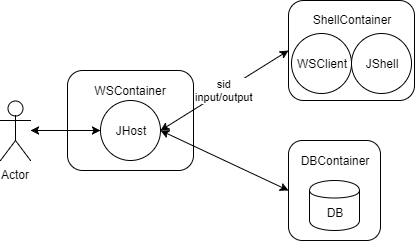

# jshell-server
A http server running more JShells

## Prerequisites

- Java 1.9
- Docker
- single available port
- least 4GB memory

## Backend container feature

- bidirectional communication
- supporting secret key for security

## Frontend server feature

- one server to many containers
- multiplexing communication for using many shells
- stable shell lifecycle
- standalone mode with play

## Sketch

